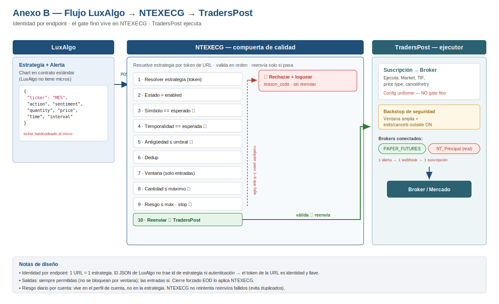

# NTEXECG — Documento de diseño y continuación
### Capa de filtros de calidad entre LuxAlgo y TradersPost
**Fecha:** 19 de junio de 2026 · **Responsable:** Sergio · **Estado:** diseño / para construcción

---

## 1. Contexto y alcance

NTEXECG es una capa intermedia que recibe las señales de LuxAlgo (vía webhook), las **valida y filtra por calidad**, y solo si pasan las reenvía a TradersPost para ejecución.

**Lo que SÍ nos toca (NTEXECG):** ventana de operación por estrategia, rechazo por antigüedad de señal, validación de símbolo/contrato y temporalidad, dedup, límites de riesgo y cierre forzado EOD.

**Lo que NO nos toca:** cómo TradersPost rutea internamente, o un error humano al crear/suscribir una estrategia en TradersPost. Eso es *el mismo problema que ya existe hoy sin NTEXECG* y queda fuera de alcance. **TradersPost pasa a ser un ejecutor "tonto":** recibe algo que NTEXECG ya decidió que es válido y lo manda al broker.

---

## 2. Arquitectura del flujo

```
LuxAlgo (estrategia + alerta)         NTEXECG (compuerta de calidad)        TradersPost (ejecutor)
  ─ JSON webhook ───────────────►  URL única por estrategia  ───────────►  webhook de la suscripción
  ticker/action/sentiment/qty       1. identifica estrategia (token URL)     ejecuta a broker (paper/real)
  price/time/interval               2. valida y filtra
                                    3. reenvía solo si pasa
```

**Principio de identidad por endpoint:** el JSON de LuxAlgo **no trae identificador de estrategia ni autenticación**. Por eso la identidad se resuelve por la **URL única** por la que entra la señal: señal que llega por `URL_A` *es* la estrategia A. Esto encaja con el modelo "un webhook por estrategia" que ya se usa, sin tener que agregar campos al JSON.

**La URL es a la vez identidad y credencial.** Como LuxAlgo/TradingView normalmente no permiten headers de autenticación (solo mandan el body), el token en el path es la única llave. Debe ser **aleatorio y largo** (UUID v4 / 32 bytes), tratarse como secreto, y reforzarse con validación del payload (ver §5).

---

## 3. Capa de responsabilidades (quién valida qué)

| Responsabilidad | NTEXECG | TradersPost |
|---|:---:|:---:|
| Ventana(s) de operación (gate fino, por estrategia) | ✅ | — (solo backstop amplio) |
| Rechazo por antigüedad de señal | ✅ | (redundante) |
| Validación símbolo/contrato correcto | ✅ | (Allowed tickers, redundante) |
| Validación de temporalidad (interval) | ✅ | — |
| Dedup de señales repetidas | ✅ | — |
| Riesgo por operación (qty × stop × tick) | ✅ | — |
| Riesgo diario por **cuenta** | ✅ (capa de cuenta) o broker/prop | — |
| Cierre forzado EOD | ✅ | (broker/regla) |
| Tipo de orden, TIF, price type | — | ✅ |
| Cancelaciones / retries | — | ✅ |
| Manejo de quantity / ejecución | — | ✅ |

> Regla de oro de las ventanas: **una sola fuente de verdad para la decisión fina = NTEXECG.** TradersPost conserva un envelope amplio de respaldo (p. ej. sesión completa) más "exits/cancels outside windows" ON, para que un fallo nuestro nunca dispare a las 3am. Nunca ventanas *finas* en ambos lados (chocarían: NTEXECG aprueba 11:25, TradersPost rechaza porque cerró 11:20).

---

## 4. El payload de LuxAlgo (lo que sí y no entrega)

```json
{
  "ticker": "MES",          // micro: hardcodear el símbolo, NO usar [[ticker]]
  "action": "[[strategy_order_action]]",
  "sentiment": "[[strategy_market_position]]",
  "quantity": "2",
  "price": "[[strategy_order_price]]",
  "time": "[[timenow]]",
  "interval": "[[timeframe]]"
}
```

Puntos clave:
- **`[[ticker]]` resuelve al símbolo del chart.** Como LuxAlgo no tiene estrategias para micros, el chart está en el contrato **estándar** (p. ej. ES). Para operar el micro hay que **hardcodear** el símbolo micro (`MES`) en el JSON. Esta es la regla correcta — sustituye al erróneo "quito la M".
- **No hay id de estrategia ni auth** en el payload → identidad por URL (§2).
- **`quantity`** debe ir siempre; hoy va fija. El *tope* lo enforza NTEXECG (§5), no LuxAlgo.
- Pendiente del usuario: confirmar con LuxAlgo qué campos puede y no puede emitir (¿puede inyectar métricas o id? Lo más probable: no, todo lo demás es registro manual).

---

## 5. Contrato del endpoint NTEXECG (orden de validación)

Por cada señal entrante, en este orden; **cualquier fallo → rechazar + loguear motivo + NO reenviar:**

1. **Resolver estrategia** por el token de la URL. Si no existe → 404/rechazo.
2. **Estado `enabled`.** Si está `disabled` → rechazo (no reenvía aunque la URL exista).
3. **Símbolo:** `payload.ticker` == símbolo esperado declarado. Si no → rechazo. *(Atrapa ES/MES, 6J/M6J, chart equivocado.)*
4. **Temporalidad:** `payload.interval` == temporalidad esperada (comparar como entero de minutos).
5. **Antigüedad:** `now - payload.time` ≤ umbral (separado entrada/salida). Si excede → rechazo.
6. **Dedup:** ignorar señal idéntica dentro de la ventana de dedup.
7. **Ventana de operación:** si es **entrada**, debe caer dentro de una ventana activa para el día actual. Las **salidas se permiten siempre**.
8. **Riesgo:** `quantity` ≤ cantidad máxima; `quantity × stop_ticks × valor_tick` ≤ riesgo_usd máx por operación; stop presente si es obligatorio.
9. **Reenviar** al webhook de TradersPost de esa estrategia.
10. **Loguear** resultado (aceptada/rechazada + motivo + payload) para auditoría.

---

## 6. Modelo de datos

NTEXECG necesita **tres entidades**, no una. Separarlas evita duplicar y contradecir datos.

### 6a. Perfil de estrategia
La ficha que se llena por estrategia (la "versión final del machote", §7).

### 6b. Perfil de cuenta
Donde vive lo que es **de la cuenta**, no de la estrategia:
- Referencia de cuenta / broker.
- **riesgo_usd máx diario por cuenta** (agrega el riesgo de todas las estrategias que apuntan a esa cuenta).
- Trailing drawdown / reglas del prop si aplica.

> Esto resuelve la observación correcta de Sergio: "el riesgo diario no lo controla la estrategia". No lo controla *una* estrategia, pero **sí necesita dueño** → la capa de cuenta. Si se relega solo al broker/prop, documentarlo explícitamente.

### 6c. Catálogo de instrumentos
Propiedades fijas del contrato (§8). La estrategia **referencia el símbolo** y NTEXECG autocompleta tipo, valor_tick y tick_size. **Esto elimina de raíz los errores de tecleo de valor de tick.**

---

## 7. Ficha de registro de estrategia — versión final (especificación de formulario)

Leyenda de **Origen**: 🔒 lo genera el sistema · ✍️ lo captura el usuario · ✅ se usa como guardarraíl de validación · 📚 autocompletado desde catálogo.

### 7.1 Identidad
| Campo | Tipo | Origen | Notas |
|---|---|---|---|
| id_interno | uuid | 🔒 | |
| nombre_corto | texto | ✍️ | Debe iniciar con el símbolo que se opera (p. ej. `MES15m...`), no el estándar |
| descripcion | texto largo | ✍️ | Documentar fuente de las métricas (ver §9d) |
| url_unica | url | 🔒 | Generada al crear |
| token | string seguro | 🔒 | UUID v4 / 32 bytes, secreto |
| estado | enum(`disabled`,`enabled`) | 🔒/✍️ | Default `disabled`; activación manual |
| fecha_alta | fecha | 🔒 | |
| responsable | texto | ✍️ | |
| created_at / updated_at / version | timestamp / int | 🔒 | Auditoría |

### 7.2 Definición de la estrategia (LuxAlgo) y backtest
| Campo | Tipo | Origen |
|---|---|---|
| toolkit / categoría | texto | ✍️ |
| gatillo | texto | ✍️ |
| filtro_1 / filtro_2 | texto | ✍️ |
| condicion_salida | texto | ✍️ |
| backtest_inicio / backtest_fin | fecha | ✍️ |
| num_operaciones | int | ✍️ |
| winrate / profit_factor / max_drawdown_pct | número | ✍️ |
| beneficio_neto / avg_win / avg_loss / max_drawdown_usd | moneda | ✍️ |
| frecuencia | texto | ✍️ |
| tamaño_orden_backtest | texto | ✍️ |

### 7.3 Instrumento y temporalidad (guardarraíles)
| Campo | Tipo | Origen |
|---|---|---|
| simbolo_esperado | ref. a catálogo | ✍️ ✅ (valida vs `ticker`) |
| tipo_contrato | enum(`micro`,`mini`,`estandar`) | 📚 |
| valor_tick | moneda | 📚 |
| tick_minimo | número | 📚 |
| temporalidad_esperada | int (minutos) | ✍️ ✅ (valida vs `interval`) |

### 7.4 Ventanas de operación — **grupo repetible** (corrección estructural)
Cada estrategia tiene **N ventanas**; cada ventana lleva **sus propios días**. Esto resuelve casos como "L–J 09:00–15:45 / V 09:00–12:00".

| Campo (por ventana) | Tipo |
|---|---|
| dias | multiselect(L,M,X,J,V,S,D) |
| hora_inicio / hora_fin | hora |

Más, a nivel estrategia:
| Campo | Tipo | Default |
|---|---|---|
| timezone | enum/tz | America/New York |
| salidas_siempre_permitidas | toggle | true |
| cierre_forzado_eod | hora | 16:00 |

### 7.5 Filtros de calidad
| Campo | Tipo | Origen |
|---|---|---|
| antiguedad_entrada_seg | int | ✍️ ✅ |
| antiguedad_salida_seg | int | ✍️ ✅ |
| dedup_seg | int | ✍️ ✅ |
| confirmaciones_adicionales | texto | ✍️ (futuro) |

### 7.6 Riesgo (per-estrategia)
| Campo | Tipo | Origen |
|---|---|---|
| stop_obligatorio | toggle | ✍️ ✅ |
| stop_esperado_ticks | int | ✍️ |
| riesgo_usd_max_operacion | moneda | ✍️ ✅ |
| cantidad_maxima_contratos | int | ✍️ ✅ |

> El **riesgo diario por cuenta NO va aquí** → vive en el perfil de cuenta (§6b). Cantidad máxima la enforza NTEXECG (rechaza si el payload pide más), aunque la cantidad *solicitada* venga de LuxAlgo.

### 7.7 Ruteo de salida
| Campo | Tipo | Origen |
|---|---|---|
| webhook_traderspost | url | ✍️ |
| cuenta_objetivo | ref. a perfil de cuenta | ✍️ |
| notas_ruteo | texto | ✍️ |

---

## 8. Catálogo de instrumentos (datos semilla)

Valores de la referencia de riesgo. NTEXECG los precarga; la estrategia solo referencia el símbolo.

| Símbolo | Tipo | Valor/tick | Tick mín. | Nota |
|---|---|---|---|---|
| MYM | micro | $0.50 | 1.00 | Micro Dow |
| M2K | micro | $0.50 | 0.10 | Micro Russell |
| MNQ | micro | $0.50 | 0.25 | Micro Nasdaq |
| MGC | micro | $1.00 | 0.10 | Micro Gold |
| MCL | micro | $1.00 | 0.01 | Micro Crude |
| MNG | micro | $1.00 | 0.001 | Micro NatGas (volátil) |
| MES | micro | $1.25 | 0.25 | Micro S&P |
| M6E | micro | $1.25 | 0.0001 | Micro Euro FX |
| M6J / MJY | micro | $1.25 | 0.000001 | Micro Yen |
| YM | mini | $5.00 | 1.00 | Dow |
| RTY | mini | $5.00 | 0.10 | Russell |
| NQ | mini | $5.00 | 0.25 | Nasdaq |
| 6E | estándar | $6.25 | 0.00005 | Euro FX |
| 6J | estándar | $6.25 | 0.0000005 | Yen |
| ES | mini | $12.50 | 0.25 | S&P |
| QO / QM / QG | mini | $12.50 | varía | Gold/Crude/NatGas |

Fórmula de riesgo: `riesgo_usd = cantidad × stop_ticks × valor_tick`.
Topes por defecto sugeridos: micro → 2 contratos, mini → 1 contrato (el riesgo_usd sigue mandando sobre el conteo).

---

## 9. Hallazgos documentados

### 9a. Correcciones de configuración en TradersPost
Detectadas comparando la config en vivo contra el manual. Se corrigen en TradersPost (no en documentos):
1. **Ventana de trading 1** terminaba **11:30 p.m.** en vez de **11:30 a.m.** → eliminaba el bloqueo de lunch y permitía entradas casi todo el día. *(Reencuadre: si las ventanas finas se mueven a NTEXECG, la de TradersPost queda como backstop amplio.)*
2. **Exit breakeven offset** = 1.5 → debe ser **0**.
3. **Reject entry if signal older than** = 1 → recomendado **2** (5m).
4. **Allowed tickers** = Any → **Only selected** con el símbolo micro (red de seguridad).

### 9b. Símbolo micro vs estándar (error recurrente)
Apareció dos veces: `6J` (estándar, $6.25/tick) usado creyendo que era micro, y `ES` vs `MES`. **Regla:** nunca "quitar la M"; **escribir explícitamente el símbolo micro** que se quiere operar. El catálogo de instrumentos (§8) elimina el error de valor de tick: no se teclea, se referencia. Verificación obligatoria en paper: confirmar que el contrato que abre es el micro de su valor de tick esperado.

### 9c. Choques de arquitectura en TradersPost
1. **La config vive en la SUSCRIPCIÓN, no en la estrategia.** Cada suscripción nueva arranca en defaults; la config buena no es global. *(Mitigado al mover el gate a NTEXECG y dejar suscripciones uniformes.)*
2. **Routing y fills duplicados.** Existen cuentas `NT_Principal` y `NT_Secundaria` (NinjaTrader, posiblemente funded) junto a `PAPER_FUTURES`/`PAPER_STOCKS`. Una alerta puede ir a múltiples URLs y un webhook a múltiples suscripciones → riesgo de disparar en cuenta real. Mantener **una alerta → un webhook → una suscripción → un broker** mientras se valida.
3. **`PAPER_STOCKS`** no debe recibir futuros (choque de asset class).
4. **Interlock ticker ↔ Allowed tickers:** si Allowed tickers = `M6J`/`MES` pero el chart manda otro símbolo, TradersPost rechaza todo. Deben coincidir.

### 9d. Escalado de métricas ES → MES
LuxAlgo **no tiene estrategias para micros**: los backtests corren sobre el contrato **estándar**. Para operar el micro:
- **Hardcodear el ticker micro** en el JSON (§4).
- Las métricas **en dólares se dividen entre 10** (ES $50/pt → MES $5/pt): neto, drawdown $, avg win/loss.
- Las métricas **porcentuales NO cambian** (winrate, PF, drawdown %) — son la prueba de que el escalado se hizo bien (solo dinero, no lógica).
- **Documentar el factor** en la descripción de cada estrategia para no planear riesgo con cifras infladas.

---

## 10. Pendientes y próximos pasos

**Construcción NTEXECG**
- [ ] Implementar el modelo de datos: perfil de estrategia (§7), perfil de cuenta (§6b), catálogo de instrumentos (§6c/§8).
- [ ] Formulario de alta con tipos/enums/toggles y **ventanas como grupo repetible** con días propios.
- [ ] Autocompletado de instrumento desde catálogo al elegir símbolo.
- [ ] Pipeline de validación del endpoint en el orden de §5, con logging de rechazos.
- [ ] Generación de URL/token segura; estrategia nace `disabled`.
- [ ] Decidir auth del payload: token en URL + (opcional) secreto embebido en el JSON.
- [ ] Dueño del riesgo diario por cuenta (capa de cuenta o broker/prop) — decisión explícita.

**TradersPost**
- [ ] Aplicar correcciones §9a.
- [ ] Reconfigurar ventanas como **backstop amplio** (no gate fino) una vez NTEXECG gatee.

**LuxAlgo**
- [ ] Confirmar qué campos puede/no puede emitir el webhook (validar el supuesto de "identidad por endpoint, métricas = registro manual").

**Validación en paper (criterios de aceptación)**
- [ ] Señal válida → pasa y ejecuta.
- [ ] Señal con símbolo distinto al declarado → rechazada.
- [ ] Señal con temporalidad distinta → rechazada.
- [ ] Señal vieja (> umbral) → rechazada.
- [ ] Señal que excede cantidad/riesgo máx → rechazada.
- [ ] Entrada fuera de ventana → rechazada; salida fuera de ventana → procesada.
- [ ] Confirmar contrato real y valor de tick del micro en el broker.


---

# Anexo A — Contrato del endpoint NTEXECG

> Versión detallada de la §5. La §5 es el resumen del orden de validación; este anexo define el contrato completo: request, autenticación, pipeline regla por regla, códigos de rechazo, respuesta, reenvío y auditoría.

## A.1 Definición del endpoint

| | |
|---|---|
| Método | `POST` |
| Ruta | `/hook/{token}` |
| Content-Type | `application/json` |
| Autenticación | token en la ruta (§A.3) |
| Origen esperado | alerta de LuxAlgo/TradingView (solo body, sin headers de auth) |

Un endpoint = una estrategia. El `{token}` resuelve la estrategia (identidad por endpoint, §2).

## A.2 Request — esquema del payload

| Campo | Tipo | Requerido | Regla |
|---|---|---|---|
| `ticker` | string | sí | Símbolo a operar; se valida contra `simbolo_esperado` |
| `action` | string | sí | `buy` / `sell` (minúsculas) |
| `sentiment` | string | sí | `long` / `short` / `flat` |
| `quantity` | string/int | sí | > 0; se valida contra `cantidad_maxima_contratos` |
| `price` | string/number | no | Referencia; con orden Market no garantiza fill |
| `time` | ISO-8601 | sí | Hora de la señal; base para antigüedad |
| `interval` | string/int | sí | Minutos; se valida contra `temporalidad_esperada` |

Ejemplo:
```json
{ "ticker": "MES", "action": "buy", "sentiment": "long", "quantity": "2",
  "price": "5432.75", "time": "2026-06-19T13:40:00.000Z", "interval": "15" }
```

Clasificación entrada vs salida (para la regla de ventana, §A.4 paso 7):
- **Entrada:** `action`+`sentiment` que abren/incrementan o revierten posición (`buy/long`, `sell/short`).
- **Salida:** cierres (`sentiment: flat`, o exit explícito). Las salidas **no** se bloquean por ventana.

## A.3 Autenticación

- **Token en la ruta** = identidad + única llave (LuxAlgo no permite headers). Aleatorio y largo (UUID v4 / 32 bytes), tratado como secreto.
- **Segunda barrera (defensa en profundidad):** validar el payload contra lo declarado (§A.4 pasos 3–4). Opcional: `passphrase`/secreto embebido en el JSON, comparado en tiempo constante.
- Token desconocido → `404` sin filtrar detalle (no revelar si existe).

## A.4 Pipeline de validación (regla por regla)

Orden estricto. Primer fallo corta el flujo: **rechazar + loguear motivo + NO reenviar.**

| # | Check | Regla | Si falla |
|---|---|---|---|
| 1 | Estrategia | `{token}` resuelve a una estrategia | `404` `UNKNOWN_TOKEN` |
| 2 | Estado | `estado == enabled` | `409` `STRATEGY_DISABLED` |
| 3 | Símbolo | `payload.ticker == simbolo_esperado` | `422` `SYMBOL_MISMATCH` |
| 4 | Temporalidad | `int(payload.interval) == temporalidad_esperada` | `422` `INTERVAL_MISMATCH` |
| 5 | Antigüedad | `now - payload.time ≤` umbral (entrada/salida según tipo) | `422` `SIGNAL_STALE` |
| 6 | Dedup | no hubo señal idéntica dentro de `dedup_seg` | `200` `DUPLICATE_IGNORED` |
| 7 | Ventana | si **entrada**: cae en una ventana activa para el día; si **salida**: siempre permitida | `422` `OUTSIDE_WINDOW` |
| 8 | Cantidad | `quantity ≤ cantidad_maxima_contratos` | `422` `QTY_EXCEEDS_MAX` |
| 9 | Riesgo | `quantity × stop_ticks × valor_tick ≤ riesgo_usd_max_operacion`; stop presente si `stop_obligatorio` | `422` `RISK_EXCEEDS_MAX` / `STOP_REQUIRED` |
| 10 | Reenvío | POST al `webhook_traderspost` | `502` `FORWARD_FAILED` (ver §A.6) |

Notas:
- Paso 6 (dedup) responde `200` porque no es un error del emisor; se ignora silenciosamente pero se loguea.
- `stop_ticks` proviene del payload (si se manda) o de `stop_esperado_ticks` del perfil.
- `valor_tick` y `tipo_contrato` salen del catálogo (no del payload).

## A.5 Respuesta

**Aceptada y reenviada:**
```json
{ "status": "accepted", "strategy_id": "...", "forwarded": true,
  "request_id": "...", "ts": "2026-06-19T13:40:01.120Z" }
```

**Rechazada:**
```json
{ "status": "rejected", "reason_code": "SYMBOL_MISMATCH",
  "detail": "expected MES, got ES", "strategy_id": "...",
  "request_id": "...", "ts": "..." }
```

Códigos HTTP: `200` aceptada/duplicada · `404` token desconocido · `409` deshabilitada · `422` falla de validación · `502` fallo de reenvío.

## A.6 Reenvío a TradersPost

- Se reenvía **solo si pasan los pasos 1–9**.
- Payload reenviado: el JSON original (TradersPost ejecuta con su propia config: tipo de orden, TIF, etc.).
- **NTEXECG no reintenta por su cuenta** (consistente con "No retries"): un `FORWARD_FAILED` se loguea y, si se desea, alerta — pero no reintenta para evitar duplicados.
- Idempotencia recomendada: incluir `request_id` para correlación en logs de ambos lados.

## A.7 Auditoría / logging

Registrar **toda** señal entrante (aceptada o rechazada):

| Campo | Descripción |
|---|---|
| `request_id` | id único de la petición |
| `received_at` | hora de recepción en NTEXECG |
| `strategy_id` | estrategia resuelta (o null) |
| `payload` | JSON crudo recibido |
| `result` | `accepted` / `rejected` / `duplicate` |
| `reason_code` | motivo si no aceptada |
| `forwarded` | bool |
| `forward_status` | código/respuesta de TradersPost |
| `latency_ms` | tiempo total de procesamiento |

Estos logs son la base para depurar rechazos y para que, más adelante, NTEXECG pueda agregar el riesgo a nivel cuenta (§6b).

## A.8 Casos borde

- **Estrategia `disabled`:** rechazo en paso 2 aunque la URL exista y LuxAlgo ya mande señales (regla de oro: nace `disabled`).
- **Salida fuera de ventana:** permitida (cerrar riesgo es prioridad).
- **Entrada fuera de ventana:** rechazada (`OUTSIDE_WINDOW`).
- **`quantity` ausente o 0:** rechazo (`QTY_EXCEEDS_MAX`/inválida) — nunca asumir default.
- **Reloj/timezone:** las ventanas se evalúan en el `timezone` del perfil; `payload.time` viene en UTC (ISO-8601) y se convierte.


---

# Anexo B — Diagrama del flujo

Las tres capas y dónde vive cada filtro. LuxAlgo envía el JSON (con el `ticker` hardcodeado al micro) a la URL única; NTEXECG corre las validaciones del Anexo A en orden y solo reenvía si pasan todas; TradersPost ejecuta como capa final con un backstop amplio de respaldo.


